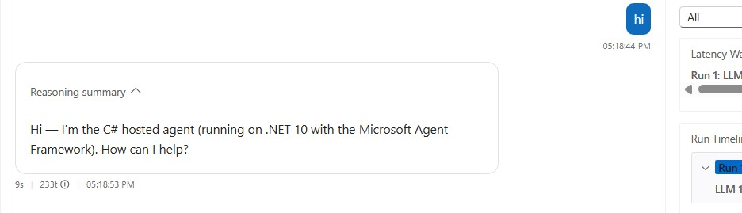
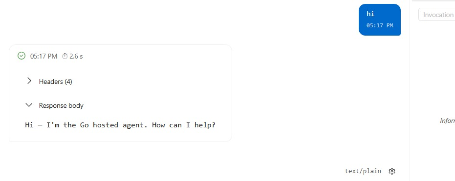

# MAF Agent Samples

This repository contains a small set of sample Microsoft Agent Framework (MAF) applications that use Microsoft Foundry and Foundry Projects. Each sample creates a simple "friendly assistant" agent and either runs it once from the console or hosts it as a long-running service.

## Projects

| Project | Language | Type | Description |
|---|---|---|---|
| `01-MAF-Agent-CS` | C# | Console app | Creates an AI agent from a Microsoft Foundry project and runs a single sample prompt, then exits. |
| `02-MAF-Agent-CS-Hosted` | C# | Hosted agent | Runs as a long-lived web service that registers a Foundry **Responses** endpoint with `AgentHost`, so Foundry can call it like any other hosted agent. |
| `03-MAF-Agent-CS-Harness` | C# | Console app | Creates a `HarnessAgent` (Microsoft Agent Framework Harness) from a Microsoft Foundry project and runs a single sample prompt, then exits. |
| `04-MAF-Agent-CS-Harness-Hosted` | C# | Hosted agent | Hosts a `HarnessAgent` as a long-lived web service that registers a Foundry **Responses** endpoint. |
| `20-MAF-Agent-GO` | Go | Console app | Creates and runs a Microsoft Agent Framework agent backed by a Foundry project, prints one response, then exits. |
| `21-MAF-Agent-GO-Hosted` | Go | Hosted agent | A containerized service that exposes Foundry's **Invocations** protocol (including the AG-UI contract) so it can be deployed and called as a Foundry hosted agent. |
| `MAF-Agents-Samples.slnx` | — | — | Solution file for the four C# projects. |
| `40-Foundry-Agent-CPP` | C++ | Console app | Calls a Foundry Project from C++20 through Microsoft Entra authentication and the project-scoped Responses REST API. |
| `41-Foundry-Agent-CPP-Hosted` | C++ | Hosted agent | Reuses the C++ client in a Linux container that exposes Foundry's **Invocations** protocol through cpp-httplib. |

**Console app vs. hosted agent, in plain terms:**
- A **console app** is a simple, one-shot program you run locally with `dotnet run` or `go run`. It calls Foundry once, prints the answer, and exits. Use these first to confirm your Foundry project and model deployment work.
- A **hosted agent** is a long-running service (web server or container) that Foundry itself deploys and calls over HTTP using a defined protocol (`responses` or `invocations`). Hosted agents are meant to be deployed with `azd` so Foundry can invoke them repeatedly, e.g. from the Foundry playground or another application.

## Prerequisites

See [Prerequisites and local setup](docs/prerequisites.md) for:

- the ready-to-use dev container and Codespaces setup;
- manual setup on Linux, macOS, and Windows;
- required Microsoft Foundry resources and Azure authentication;
- Bash, Zsh, PowerShell, and Command Prompt environment-variable syntax; and
- troubleshooting for common shell, credential, model, and vcpkg errors.

> **Note on preview packages:** The C# samples reference preview/beta NuGet packages (`Azure.AI.Projects`, `Microsoft.Agents.AI.Foundry`, `Microsoft.Agents.AI.Foundry.Hosting`, `Microsoft.Agents.AI.Harness`). These SDKs are under active development and their APIs may change between versions. If a sample fails to build after `dotnet restore`, check whether a newer preview package version changed an API used in `Program.cs`.

> **C++ support boundary:** Microsoft Foundry and Microsoft Agent Framework do not currently provide a first-party C++ agent SDK or hosting adapter. The C++ samples use first-party `azure-identity-cpp` for authentication and repository-owned REST and hosting adapters. See [C++ Agents with Microsoft Foundry](docs/research/cpp-agents-with-microsoft-foundry.md) for the full research and trade-off analysis.

## Dev container

The fastest way to prepare all eight samples is to open the repository in its
devcontainer. It provides .NET 10, Go 1.26, C++20, CMake, Ninja, vcpkg, Azure
CLI, Azure Developer CLI, and GitHub CLI on Ubuntu 24.04.

[](https://vscode.dev/redirect?url=vscode://ms-vscode-remote.remote-containers/cloneInVolume?url=https://github.com/Azure-Samples/microsoft-foundry-hosted-agents)

For local use, install [Docker Desktop](https://www.docker.com/products/docker-desktop/)
and the [Dev Containers extension](https://marketplace.visualstudio.com/items?itemName=ms-vscode-remote.remote-containers),
then run **Dev Containers: Reopen in Container** from the VS Code command
palette. GitHub Codespaces automatically uses the same configuration.

The container automatically builds all eight samples when it is first created.
This can take several minutes while vcpkg builds C++ dependencies. Persistent
cache volumes make subsequent rebuilds and recreated containers faster. After
the initialization finishes, you only need to run `az login` inside the
container, set the environment variables below, and choose an agent from the
[Run](#run) section.

The default configuration does not mount a Docker socket. Docker is unnecessary
for source builds and local runs.

## Environment variables

All samples use the same two environment variable names:

- `FOUNDRY_PROJECT_ENDPOINT` — your Foundry project endpoint from the prerequisites step above.
- `AZURE_AI_MODEL_DEPLOYMENT_NAME` — the model deployment name in that project (defaults to `gpt-5-mini` in every sample if unset).

Use syntax for your current shell. The dev container and Codespaces open Bash
by default:

```bash
export FOUNDRY_PROJECT_ENDPOINT="https://<resource>.services.ai.azure.com/api/projects/<project>"
export AZURE_AI_MODEL_DEPLOYMENT_NAME="gpt-5-mini"
```

PowerShell:

```powershell
$env:FOUNDRY_PROJECT_ENDPOINT = "https://<resource>.services.ai.azure.com/api/projects/<project>"
$env:AZURE_AI_MODEL_DEPLOYMENT_NAME = "gpt-5-mini"
```

The variables last only for the current terminal. The samples do not load
`.env` files automatically. See the [setup guide](docs/prerequisites.md#set-the-environment-variables)
for Windows Command Prompt syntax and `.env` guidance.

## Build

From the repository root, build all eight samples with the commands for your
shell. In VS Code on any operating system, you can instead run the
**Build and test all samples** task.

> **Dev container and Codespaces:** The initial container setup already runs
> these builds. Run them again only after changing code or when you want to
> verify the workspace; use the VS Code task when you also want to run tests.

### Linux, macOS, dev container, or Codespaces (Bash/Zsh)

```bash
dotnet build ./MAF-Agents-Samples.slnx
(cd ./20-MAF-Agent-GO && go build ./...)
(cd ./21-MAF-Agent-GO-Hosted && go build ./...)
(cd ./40-Foundry-Agent-CPP && cmake --preset debug && cmake --build --preset debug)
(cd ./41-Foundry-Agent-CPP-Hosted && cmake --preset debug && cmake --build --preset debug)
```

### Windows (PowerShell)

```powershell
dotnet build ./MAF-Agents-Samples.slnx
Push-Location ./20-MAF-Agent-GO; go build ./...; Pop-Location
Push-Location ./21-MAF-Agent-GO-Hosted; go build ./...; Pop-Location
Push-Location ./40-Foundry-Agent-CPP; cmake --preset debug; cmake --build --preset debug; Pop-Location
Push-Location ./41-Foundry-Agent-CPP-Hosted; cmake --preset debug; cmake --build --preset debug; Pop-Location
```

## Run

Set the environment variables first, then run one sample at a time. For
Inspector usage, second-terminal commands, protocol details, and
troubleshooting, see [Run the hosted agents locally](docs/run-hosted-agents-locally.md).

### Console agents

```bash
dotnet run --project ./01-MAF-Agent-CS/01-MAF-Agent-CS.csproj
dotnet run --project ./03-MAF-Agent-CS-Harness/03-MAF-Agent-CS-Harness.csproj
(cd ./20-MAF-Agent-GO && go run .)
./40-Foundry-Agent-CPP/build/debug/maf_agent_cpp_40
```

### C# hosted agent

```bash
cd ./02-MAF-Agent-CS-Hosted
azd ai agent run
```



### C# Harness hosted agent

```bash
cd ./04-MAF-Agent-CS-Harness-Hosted
azd ai agent run
```

### Go hosted agent

```bash
cd ./21-MAF-Agent-GO-Hosted
azd ai agent run --start-command "go run ."
```



### C++ hosted agent

```bash
cd ./41-Foundry-Agent-CPP-Hosted
azd ai agent run --start-command "./build/debug/maf_agent_cpp_41"
```


Each launch opens Agent Inspector on port `8087` and hosts the agent on port
`8088`. Stop the current agent before launching another one.

## Test

Run all available tests from the repository root.

Bash/Zsh:

```bash
(cd ./20-MAF-Agent-GO && go test ./...)
(cd ./21-MAF-Agent-GO-Hosted && go test ./...)
(cd ./40-Foundry-Agent-CPP && ctest --preset debug)
(cd ./41-Foundry-Agent-CPP-Hosted && ctest --preset debug)
```

PowerShell:

```powershell
Push-Location ./20-MAF-Agent-GO; go test ./...; Pop-Location
Push-Location ./21-MAF-Agent-GO-Hosted; go test ./...; Pop-Location
Push-Location ./40-Foundry-Agent-CPP; ctest --preset debug; Pop-Location
Push-Location ./41-Foundry-Agent-CPP-Hosted; ctest --preset debug; Pop-Location
```

The C++ tests inject credentials and HTTP transports, so they do not require
Azure access. The C# samples do not currently have automated tests; they are
intended as minimal, readable starting points.

## Continuous integration

A minimal GitHub Actions workflow (`.github/workflows/build.yml`) builds the .NET solution and builds/tests the Go and C++ samples on every push and pull request to `main`. It does not require Foundry credentials since it only validates that the code compiles and unit tests pass.

## Resources

- [Microsoft Foundry documentation](https://learn.microsoft.com/azure/ai-foundry/)
- [Microsoft Foundry portal](https://ai.azure.com)
- [Microsoft Agent Framework documentation](https://learn.microsoft.com/agent-framework/overview/agent-framework-overview)
- [Microsoft Agent Framework GitHub repository](https://github.com/microsoft/agent-framework)
- [Deploy and host agents in Microsoft Foundry](https://learn.microsoft.com/azure/ai-foundry/agents/how-to/hosted-agents-overview)
- [Azure Developer CLI (`azd`) documentation](https://learn.microsoft.com/azure/developer/azure-developer-cli/overview)
- [C++ Agents with Microsoft Foundry: Current Options, Gaps, and Recommended Architecture](docs/research/cpp-agents-with-microsoft-foundry.md)
- [Azure SDK for C++](https://github.com/Azure/azure-sdk-for-cpp)
- [vcpkg C++ package manager](https://vcpkg.io)

## Notes

These samples are intended for learning and experimentation with the Microsoft Agents SDK, Microsoft Agent Framework and Microsoft Foundry integration.

## License

This project is licensed under the MIT License. See the [LICENSE](LICENSE) file for details.
