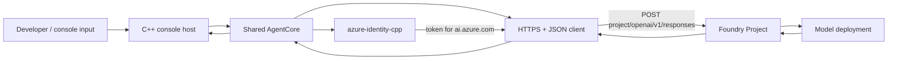
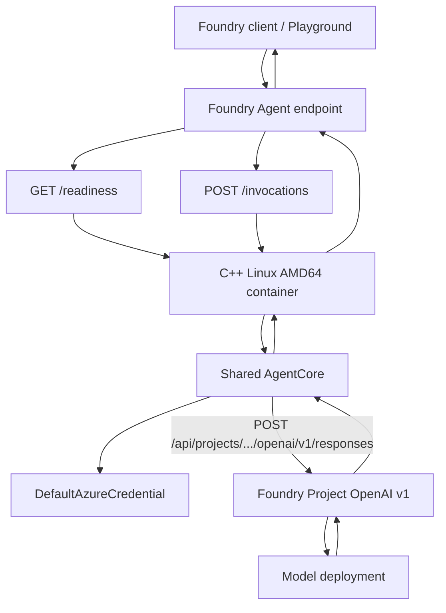
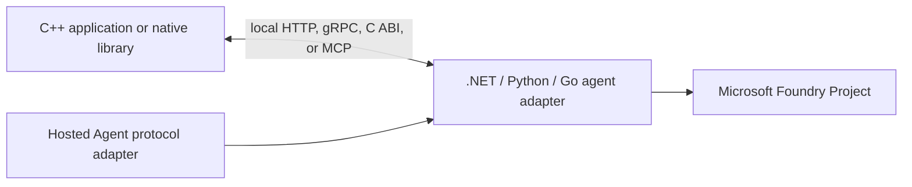

> **Implementation status**
>
> Baseline C++20 samples now exist at **MAF-Agent-CPP-05** (local console agent) and **MAF-Agent-CPP-06** (Foundry-hosted custom container). Both use `azure-identity-cpp` for Microsoft Entra authentication and a repository-owned libcurl Responses client. The hosted sample uses cpp-httplib and declares Foundry Invocations protocol `2.0.0`. The source and offline tests are implemented; local model calls, container execution, Foundry deployment, and managed-identity behavior still require validation in a configured environment.

# C++ Agents with Microsoft Foundry: Current Options, Gaps, and Recommended Architecture

**Research date:** August 27, 2026  
**Repository baseline:** `Azure-Samples/microsoft-foundry-hosted-agents` at commit `47d3f1d13905a3f087d15fee275f8153fa754420`  
**Query type:** Technical deep dive

## Executive Summary

A C++ developer can build both scenarios represented by this repository today: a local executable that calls a model deployment in a Microsoft Foundry Project, and a Linux container that exposes the Foundry Hosted Agent runtime contract. The important qualification is that C++ is not a first-class language in the current Microsoft Foundry agent SDK or Microsoft Agent Framework: there is no C++ equivalent of `Azure.AI.Projects`, `Microsoft.Agents.AI.Foundry`, or `agent-framework-go`.[^1][^2]

The most direct pure-C++ path is therefore standards based: use `azure-identity-cpp` for Microsoft Entra authentication, call the project-scoped OpenAI Responses endpoint over HTTPS, and expose `/invocations` plus `/readiness` from a Linux AMD64 container.[^3][^4][^5] This is viable for an educational sample and for controlled workloads, but the application must own request models, token attachment, streaming, tool-call orchestration, session state, protocol behavior, retries, and telemetry.

For the repository's next pair of samples, the recommended baseline is a shared C++ agent core with two thin hosts:

1. a console entry point equivalent to `MAF-Agent-CS-01` and `MAF-Agent-GO-03`; and
2. a custom-container HTTP entry point equivalent to `MAF-Agent-GO-04`, using Foundry Invocations protocol `2.0.0`.

For production systems that need complete Responses semantics, platform-managed conversations, rich tool calling, or the lowest support risk, a supported .NET, Python, or Go adapter should remain the orchestration boundary while C++ is integrated through a local bridge, MCP tool, A2A service, or native library.

## Scope and Assumptions

- "Run locally" means a C++ process running on the developer machine while calling cloud resources in a Microsoft Foundry Project. It does **not** mean running an on-device model with Foundry Local.
- "Hosted Agent" means a custom container deployed to Foundry Agent Service with `host: azure.ai.agent`, `kind: hosted`, and a declared protocol.
- The target behavior is the simple friendly assistant in the repository, with streaming and tools treated as progressive enhancements rather than minimum requirements.
- At the research baseline, the local `cpp-hosted-agent` branch was identical to `main` and had no C++ implementation.

## 1. What the Existing C# and Go Samples Establish

The repository contains four reference scenarios:

| Sample | Execution model | Agent client | Authentication | Hosting protocol |
|---|---|---|---|---|
| `MAF-Agent-CS-01` | Local console | `AIProjectClient.AsAIAgent()` | `AzureCliCredential` | None |
| `MAF-Agent-CS-02` | Foundry-hosted source deployment | Same Foundry agent abstraction | `DefaultAzureCredential` | Responses `2.0.0` |
| `MAF-Agent-GO-03` | Local console | `foundryprovider.NewAgent()` | `DefaultAzureCredential` | None |
| `MAF-Agent-GO-04` | Foundry-hosted custom container | Same Go agent abstraction | `DefaultAzureCredential` | Invocations `2.0.0`, with optional AG-UI SSE |

The local C# sample reads `FOUNDRY_PROJECT_ENDPOINT` and `AZURE_AI_MODEL_DEPLOYMENT_NAME`, creates an agent with fixed instructions, runs one prompt, prints the answer, and exits.[^6] The Go local sample follows the same lifecycle through `foundryprovider.NewAgent()` and `RunText(...).Collect()`.[^7]

The hosted C# sample reuses the same agent construction but adds the official .NET Foundry hosting adapter. That adapter registers the Responses protocol and owns the web-host behavior.[^8] The hosted Go sample cannot use an equivalent official Responses adapter, so it implements a custom HTTP server, exposes `/invocations` and `/readiness`, and declares `invocations` version `2.0.0` in `azure.yaml`.[^9][^10]

This gives the intended C++ design a useful rule:

> The model-facing agent logic should be reusable. Local and hosted modes should differ primarily in their entry point and transport.

## 2. Current C++ Support Landscape

### 2.1 Microsoft Foundry and Agent Framework

Current Foundry quickstarts and SDK guidance expose supported paths for Python, C#, JavaScript/TypeScript, Java, REST, `azd`, VS Code, and declarative experiences, depending on the specific workflow. C++ is not offered as a Foundry SDK language or hosted-agent quickstart language.[^1][^11]

Microsoft Agent Framework currently provides .NET and Python implementations and links to a separate Go implementation. Its repository has no C++ implementation, package, or hosting adapter.[^2]

Consequences for C++:

- no `AIProjectClient` equivalent;
- no typed Foundry agent client;
- no `AIAgent` abstraction;
- no built-in agent session or tool loop;
- no official Responses or Invocations server adapter;
- no first-party C++ package that emits the platform's expected OpenTelemetry spans automatically.

### 2.2 Azure SDK for C++

The official Azure SDK for C++ is still useful, but only at the infrastructure layer. Its current `sdk/` tree includes core, identity, storage, Key Vault, Event Hubs, Tables, App Configuration, and Attestation packages; it does not include AI Projects, Foundry, Azure OpenAI, or Agent Framework clients.[^3]

`azure-identity-cpp` does provide the credential types needed by this design, including `DefaultAzureCredential`, `AzureCliCredential`, `ManagedIdentityCredential`, `WorkloadIdentityCredential`, and service-principal credentials.[^12] It can request a token for the Foundry data-plane scope, after which the C++ application attaches the bearer token to its HTTPS requests.

### 2.3 Community and Protocol-Level Building Blocks

| Need | Credible C++ option | Status and caveat |
|---|---|---|
| HTTP client | libcurl, CPR, or `azure-core-cpp` transport primitives | Mature, but Foundry request types remain application-owned |
| HTTP server | cpp-httplib, Drogon, or Boost.Beast | Mature; the application owns Hosted Agent routes and lifecycle |
| JSON | nlohmann/json | Mature and widely used |
| AG-UI | `ag-ui-protocol/ag-ui/sdks/community/c++` | Complete community-tier C++17 source, but no first-party SLA or published package[^13] |
| MCP | Community C++ implementations or direct JSON-RPC/HTTP | No official Microsoft C++ SDK; treat as community integration |
| A2A | Direct HTTP/JSON-RPC/SSE or community code | A2A is preview in Foundry and has no official C++ SDK[^14] |
| Telemetry | OpenTelemetry C++ | Traces, metrics, and logs are stable, but Foundry-specific conventions must be wired manually[^15] |
| High-level agent orchestration | Community projects | No community option currently offers parity and supportability comparable to Microsoft Agent Framework |

Community OpenAI C++ clients can reduce basic HTTP and JSON boilerplate, but most assume OpenAI API keys and standard OpenAI base URLs. They do not remove the need to integrate `DefaultAzureCredential`, preserve the Foundry Project path, or implement the Hosted Agent server contract.

### 2.4 Foundry Local Is a Different Product Path

The `microsoft/foundry-local` repository contains C++ source:

- a build-from-source, Windows-only C++17 SDK under `sdk/cpp/`; and
- a larger cross-platform rewrite under `sdk_v2/cpp/` that is still under development and not released as a supported package.[^16]

However, the public Microsoft Learn SDK reference lists C#, JavaScript, Python, and Rust, not C++.[^17] More importantly, Foundry Local runs models on the developer device. It does not reproduce the repository's requirement to use a cloud Foundry Project, and the currently usable C++ path cannot serve as the Linux AMD64 Hosted Agent container.

Foundry Local is therefore relevant to a broader discussion of C++ AI development, but it is not the implementation foundation for these two parity scenarios.

## 3. The Exact Cloud Call a C++ Agent Must Make

The current Go and .NET implementations reveal the exact model-deployment path used by their high-level Foundry adapters. Given:

```text
FOUNDRY_PROJECT_ENDPOINT=
https://<account>.services.ai.azure.com/api/projects/<project>
```

the model-deployment agent calls:

```http
POST https://<account>.services.ai.azure.com/api/projects/<project>/openai/v1/responses
Authorization: Bearer <access token for https://ai.azure.com/.default>
Content-Type: application/json
```

The project path is preserved; the clients append `/openai/v1/`, and the Responses client appends `/responses`.[^18] The Go provider and .NET `ProjectOpenAIClient` both use the Foundry scope `https://ai.azure.com/.default` for this `*.services.ai.azure.com/api/projects/...` surface.[^18]

A minimal request equivalent to the repository's simple agent is:

```json
{
  "model": "gpt-5-mini",
  "instructions": "You are a friendly assistant. Keep your answers brief.",
  "input": [
    {
      "role": "user",
      "content": "Hello! Tell me a fun fact about C++."
    }
  ]
}
```

If the C++ application calls an already-deployed named server agent instead of a model deployment, the path changes to:

```text
<project-endpoint>/agents/<agent-name>/endpoint/protocols/openai/responses?api-version=v1
```

That is a different operating mode and should not be used for the initial C++ parity sample.[^18]

### What the Missing SDK Would Normally Do

A production-quality C++ wrapper needs to own at least:

1. project endpoint validation and URL construction;
2. acquisition and caching of the `https://ai.azure.com/.default` token;
3. bearer-header attachment and token refresh;
4. JSON serialization and response parsing;
5. timeout, cancellation, retry, and `Retry-After` handling;
6. correlation/request IDs and diagnostic logging;
7. SSE parsing for streamed Responses events;
8. tool-call accumulation and the multi-step tool execution loop;
9. conversation or response continuation;
10. stable, testable error types.

For the first sample, items 1-6 and a non-streaming response are sufficient. Items 7-9 should be separate follow-on capabilities.

## 4. Scenario A: Local C++ Agent Using a Foundry Project

### Recommended Architecture



### Suggested Internal API

```cpp
struct AgentRequest
{
    std::string input;
};

struct AgentResponse
{
    std::string text;
    std::string responseId;
};

class AgentCore
{
public:
    virtual ~AgentCore() = default;
    virtual AgentResponse Run(const AgentRequest& request) = 0;
};
```

`FoundryResponsesAgent` would implement `AgentCore` and own the credential, endpoint, deployment name, instructions, HTTP pipeline, and response parsing. The console executable would only read configuration, call `Run`, and print the result.

### Authentication Behavior

For parity with the two current local samples:

- use `DefaultAzureCredential` as the default so the same code can work locally and in the hosted container;
- document `az login` as the expected local developer credential;
- optionally allow an explicit `AzureCliCredential` development mode if exact C# behavior is desired;
- never use API keys as the default sample path.

`DefaultAzureCredential` is a better shared-core choice than the C# local sample's narrower `AzureCliCredential`, because it also supports workload or managed identity in hosted mode.[^12]

### Minimum Local Validation

- missing `FOUNDRY_PROJECT_ENDPOINT` produces an actionable startup error;
- malformed project endpoint is rejected before the first request;
- missing deployment name either produces an error or intentionally uses `gpt-5-mini`, matching repository convention;
- the token is requested for `https://ai.azure.com/.default`;
- the final URL preserves `/api/projects/<project>`;
- one prompt returns assistant text;
- 401, 403, 404, 429, timeout, and malformed-response paths remain distinguishable;
- no credential, token, or full authorization header is logged.

## 5. Scenario B: The Same C++ Agent as a Foundry Hosted Agent

### Recommended Protocol: Invocations `2.0.0`

Foundry Hosted Agents expose Responses, Invocations, Invocations WebSocket, Activity, and preview A2A paths. The platform documentation explicitly routes custom streaming protocols such as AG-UI through Invocations.[^4]

For C++ today:

- **Invocations is the lowest-risk baseline** because the platform accepts application-defined request and response bodies.
- **Responses offers better platform parity** but requires a correct OpenAI Responses-compatible server implementation that C++ does not currently receive from an official adapter.
- **Invocations WebSocket** is intended for duplex real-time scenarios such as voice and is unnecessary for this text agent.
- **A2A** is preview and should not be the first hosting contract.

The initial sample should therefore mirror the Go hosted sample's deployment shape:

```yaml
services:
  cpp-agent:
    project: .
    host: azure.ai.agent
    language: docker
    docker:
      remoteBuild: true
    uses:
      - foundry-project
    env:
      AZURE_AI_MODEL_DEPLOYMENT_NAME: ${AZURE_AI_MODEL_DEPLOYMENT_NAME}
    kind: hosted
    protocols:
      - protocol: invocations
        version: 2.0.0
```

This is the demonstrated custom-container route in the existing repository.[^10]

### Container Runtime Contract

The authoritative runtime contract requires the container to:

- bind plain HTTP to `0.0.0.0`;
- use port `8088` by default and honor `PORT` when supplied;
- expose `GET /readiness` and return `200 OK`;
- expose `POST /invocations` for the declared Invocations protocol;
- handle graceful termination and flush pending state under `$HOME`;
- run in the supported Linux AMD64 container environment.[^5][^19]

Important distinction:

- the `{"status":"ready"}` readiness body and 405 behavior in the Go sample are good conventions, but only the successful `GET /readiness` status is the platform requirement;
- running as root is a workaround documented by the current Go sample for its root-owned `/home/session` mount, not a universal language requirement;
- `AZURE_AI_MODEL_DEPLOYMENT_NAME` is explicitly passed through the repository's `azure.yaml`; it should not be assumed to be an intrinsic platform variable.

### Hosted Architecture



### Initial Request Contract

For the smallest useful parity sample, accept:

1. raw UTF-8 text;
2. a JSON string containing the prompt; and
3. optionally, a small JSON object with `input`.

Return `text/plain` for these forms. This duplicates the useful part of the Go sample without requiring AG-UI on day one.[^9]

AG-UI streaming can then be added as a separately tested path using the community C++ SDK. The SDK is substantial and covers the protocol event model, but it is community-tier source with no published package, so the repository should pin an exact commit and describe that support boundary.[^13]

### Session and Concurrency Design

The Go sample keeps one in-memory session protected by a mutex. That is understandable for a small demonstration but should not be copied blindly into a production C++ service.[^9]

Recommended C++ behavior:

- make the plain-text endpoint stateless by default;
- when a request contains a platform/session/thread identifier, key state by that identifier;
- never share one conversation history across unrelated callers;
- bound the number and lifetime of in-memory sessions;
- use `$HOME` only when persistence is intentional;
- serialize concurrent mutations per session, not across the whole process;
- define shutdown behavior for in-flight model calls.

## 6. Implementation Options

### Option A: Pure C++ with Raw REST

**Stack:** `azure-identity-cpp` + libcurl/CPR or `azure-core-cpp` HTTP + nlohmann/json + cpp-httplib/Drogon.

**Advantages**

- one language and one native runtime;
- smallest conceptual dependency on unsupported agent frameworks;
- transparent protocol behavior;
- portable local executable;
- deployable through the same Docker/`azure.yaml` path as Go.

**Disadvantages**

- highest amount of application-owned protocol code;
- no Microsoft-supported agent abstraction;
- manual SSE, tools, session, retry, and telemetry behavior;
- greater maintenance exposure when APIs evolve.

**Best fit:** repository sample, proof of concept, constrained agent, or organization committed to owning a native Foundry adapter.

### Option B: A Typed C++ Foundry Wrapper

Build a small internal library over `azure-core-cpp` that exposes typed Responses request/response models and policies.

**Advantages**

- isolates Foundry details from the sample hosts;
- gives tests a stable seam;
- can later add streaming and tools without changing entry points;
- creates a reusable asset for other C++ applications.

**Disadvantages**

- still an unsupported client owned by the project;
- code generation or hand-maintained models add build complexity;
- does not solve server-side hosting semantics automatically.

**Best fit:** production organization choosing pure C++ for strategic reasons.

### Option C: Community OpenAI or Agent Library

Use a community OpenAI C++ client or native agent framework and configure the Foundry base URL and bearer token.

**Advantages**

- less initial HTTP/JSON boilerplate;
- some libraries provide streaming or tool-call helpers.

**Disadvantages**

- Azure/Foundry authentication and endpoint behavior are usually not first class;
- maintenance quality varies;
- a community agent API can become a second compatibility surface;
- it does not remove the need for the Foundry Hosted Agent server contract.

**Best fit:** experimentation after repository and security review. Not the recommended baseline.

### Option D: Supported-Runtime Sidecar or Bridge

Keep the agent orchestration in .NET, Python, or Go and expose a small local HTTP/gRPC/C ABI to the C++ application.



**Advantages**

- best parity with supported agent frameworks;
- supported token, Responses, streaming, and tool behavior;
- lower API-evolution risk;
- C++ can remain focused on native domain logic.

**Disadvantages**

- two language runtimes and two dependency graphs;
- process lifecycle and local transport must be managed;
- extra diagnostic and deployment complexity.

**Best fit:** production systems needing full capabilities or Microsoft-supported orchestration.

### Option E: C++ as an MCP Tool or A2A Sub-Agent

Expose the C++ capability to a supported Foundry agent rather than making C++ the orchestrator.

**Advantages**

- excellent fit for existing native libraries, simulation engines, signal processing, or high-performance workloads;
- keeps conversation and model orchestration in a supported stack;
- clean service boundary.

**Disadvantages**

- does not demonstrate a C++-owned top-level agent;
- no official Microsoft C++ MCP or A2A SDK;
- A2A is still preview in Foundry.

**Best fit:** production composition when C++ is the specialized capability rather than the user-facing agent runtime.

## 7. Decision Matrix

Scores are relative recommendations, where 5 is strongest.

| Approach | Local parity | Hosted parity | Rich streaming/tools | Microsoft supportability | Native purity | Maintenance burden | Overall use |
|---|---:|---:|---:|---:|---:|---:|---|
| Raw REST, pure C++ | 4 | 4 with Invocations | 2 | 2 | 5 | 2 | Best educational baseline |
| Typed internal C++ wrapper | 4 | 4 with Invocations | 3 | 2 | 5 | 3 | Best long-term pure-C++ investment |
| Community OpenAI/agent library | 3 | 3 | 3 | 1 | 5 | 2 | Experimental |
| Supported-runtime bridge | 5 | 5 | 5 | 4 | 2 | 4 | Best production default |
| C++ MCP/A2A component | 2 | 3 | 4 | 2 | 4 | 3 | Best when C++ is a tool/sub-agent |
| Foundry Local C++ | 1 for this goal | 0 | 3 | 1-2 | 5 | 2 | Different on-device use case |

## 8. Recommended Repository Direction

### Baseline Sample Architecture

Create two projects backed by one shared library:

```text
MAF-Agent-CPP-05/
  CMakeLists.txt
  vcpkg.json
  include/foundry_agent/
  src/
    agent.cpp
    config.cpp
    http_transport.cpp
    main.cpp
  tests/

MAF-Agent-CPP-06/
  CMakeLists.txt
  vcpkg.json
  Dockerfile
  azure.yaml
  .agentignore
  include/foundry_host/
  src/
    host.cpp
    main.cpp
  tests/
```

### Recommended Dependency Baseline

- C++20;
- CMake with a checked-in `vcpkg.json`;
- `azure-identity-cpp`;
- libcurl for HTTPS;
- nlohmann/json;
- cpp-httplib for the educational server;
- Catch2 for offline unit tests;
- OpenTelemetry C++ as a follow-on, not a prerequisite;
- AG-UI community C++ only in a later streaming milestone.

### Why Invocations First

The initial C++ sample should not attempt to reproduce the entire OpenAI Responses server contract. Invocations:

- is already demonstrated by the Go sample;
- permits a small plain-text contract;
- allows the same agent core to be exercised locally and remotely;
- reduces the first implementation to auth, one model request, one HTTP server, readiness, and deployment;
- leaves AG-UI streaming and tool calls as explicit later layers.

### Production Recommendation

Use pure C++ only when one or more of these are true:

- the process cannot embed another runtime;
- native footprint or ABI requirements dominate;
- the organization is prepared to maintain a Foundry adapter;
- the agent is intentionally simple and its protocol surface is tightly controlled.

Prefer a .NET, Python, or Go bridge when:

- platform-managed Responses semantics are required;
- tools, MCP, A2A, or multi-agent orchestration are central;
- the application requires rapid alignment with new Foundry features;
- formal vendor support and examples matter more than single-language purity.

## 9. Progressive Validation Plan

### Gate 1: Local Model Call

- acquire an Entra token through `DefaultAzureCredential`;
- prove the token scope is `https://ai.azure.com/.default`;
- call `<project-endpoint>/openai/v1/responses`;
- parse one non-streaming text response;
- compare behavior with C# and Go console samples.

### Gate 2: Local Hosted-Agent Contract

- run the C++ server locally;
- verify bind address and `PORT`;
- verify `GET /readiness`;
- verify `POST /invocations` with raw text and JSON string;
- test SIGTERM and in-flight request shutdown;
- test concurrent requests and absence of cross-session state leakage.

### Gate 3: Container

- build a Linux AMD64 image;
- verify CA certificates and TLS dependencies in the final image;
- run as non-root first, then document a root requirement only if the Foundry session mount proves it necessary;
- scan the final dependency and license inventory;
- run the same contract tests against the container.

### Gate 4: Foundry Deployment

- deploy through `language: docker`, `remoteBuild: true`;
- confirm the agent identity can acquire the Foundry token;
- invoke through the Foundry Invocations endpoint;
- verify readiness, logs, request IDs, and failures;
- compare output with local mode.

### Gate 5: Optional Feature Parity

- streamed Responses client;
- AG-UI SSE output;
- tool calling with bounded loop count;
- per-session conversation state;
- MCP toolbox connection;
- OpenTelemetry spans and Application Insights correlation;
- evaluation dataset equivalent to the C# hosted sample.

## 10. Key Risks

| Risk | Severity | Mitigation |
|---|---|---|
| No official C++ Foundry/Agent Framework SDK | High | Keep a small adapter boundary; pin API behavior with integration tests |
| Incorrect token audience or endpoint construction | High | Assert exact scope and URL; compare with upstream Go/.NET source[^18] |
| Manual token refresh and 401 replay | High | Centralize credential policy and test forced expiry |
| SSE and tool-call complexity | High | Ship non-streaming first; add event conformance tests before enabling |
| Cross-user session leakage | High | Stateless default or session-keyed bounded store |
| C++ TLS/ABI dependency mismatch in Linux image | Medium | Build and run in one distro family; pin compiler and packages |
| Community AG-UI/MCP dependency maturity | Medium | Pin commits, vendor only after review, maintain protocol-level tests |
| Foundry contract and `azd` extension evolution | Medium | Pin tool versions where possible and keep deployment smoke tests |
| Misrepresenting Foundry Local as cloud Foundry support | Medium | Document it as a separate on-device product path |

## 11. Capability Verdict

### Educational / Repository Sample

**Go.** A pure C++ pair is technically justified and valuable because it demonstrates the lower-level, language-neutral boundary of Foundry:

- local cloud inference is a standard authenticated HTTPS call;
- hosted deployment is a custom-container contract;
- the absence of a C++ agent SDK becomes an explicit teaching point rather than a hidden limitation.

The first version should intentionally limit itself to non-streaming text, no tools, stateless invocations, and Invocations protocol `2.0.0`.

### Production

**Conditional go.** A pure C++ agent is viable only if the team accepts ownership of the missing SDK and protocol layers. For a general-purpose production agent with tools, streaming, multi-turn state, and rapid Foundry feature adoption, a supported-runtime bridge is the lower-risk architecture.

## Confidence Assessment

### High Confidence

- The repository's C# and Go local/hosted behavior and configuration.
- The absence of C++ in the current Foundry SDK and Microsoft Agent Framework surfaces.
- The absence of AI/Foundry clients in the Azure SDK for C++.
- The exact project-scoped Responses URL and `https://ai.azure.com/.default` token scope used by the current Go and .NET adapters.
- The custom-container `azure.yaml` pattern and Invocations `2.0.0` declaration.
- The Hosted Agent network, readiness, and route contract.

### Medium Confidence

- `azure-identity-cpp` behavior inside the Foundry-managed hosted sandbox. The credential supports the required mechanisms, but this repository does not yet prove the C++ runtime path.
- The best C++ HTTP/server library choice. The recommended libraries are mature, but the final choice depends on footprint, concurrency, and repository conventions.
- The operational suitability of the AG-UI community C++ SDK. Its source and tests are substantial, but it lacks a published package and first-party support commitment.

### Requires Experiment

- Managed/workload identity acquisition from a deployed C++ Hosted Agent.
- Whether the sample can run non-root while using the platform's session filesystem.
- End-to-end Invocations behavior through the Foundry Playground for each chosen content type.
- Application Insights correlation using OpenTelemetry C++ without an official Foundry adapter.
- Tool-call and streaming conformance if those features are added.

## Footnotes

[^1]: [Microsoft Foundry Agent Service overview](https://learn.microsoft.com/en-us/azure/foundry/agents/overview) and [Hosted Agent quickstart](https://learn.microsoft.com/en-us/azure/foundry/agents/quickstarts/quickstart-hosted-agent), updated August 27, 2026. These list current supported SDK and quickstart paths; C++ is absent.

[^2]: [microsoft/agent-framework README](https://github.com/microsoft/agent-framework/blob/947d933f2385b3f38ff40bef5b0c0245acdf3798/README.md#L1-L10). The framework describes .NET and Python support and links to Go; no C++ implementation is present.

[^3]: [Azure SDK for C++ `sdk/` tree](https://github.com/Azure/azure-sdk-for-cpp/tree/9dacd081b645f5449eafb08676bed1542cf33a23/sdk). The current tree contains no AI Projects, Foundry, OpenAI, or agent package.

[^4]: [Hosted agents in Foundry Agent Service](https://learn.microsoft.com/en-us/azure/foundry/agents/concepts/hosted-agents). The protocol table covers Responses, Invocations, Invocations WebSocket, Activity, and preview A2A, and routes AG-UI-style custom streaming through Invocations.

[^5]: [Hosted Agent runtime contract](https://learn.microsoft.com/en-us/azure/foundry/agents/concepts/hosted-agent-contract), updated August 27, 2026.

[^6]: [MAF-Agent-CS-01/Program.cs:1-15](https://github.com/Azure-Samples/microsoft-foundry-hosted-agents/blob/47d3f1d13905a3f087d15fee275f8153fa754420/MAF-Agent-CS-01/Program.cs#L1-L15).

[^7]: [MAF-Agent-GO-03/main.go:18-56](https://github.com/Azure-Samples/microsoft-foundry-hosted-agents/blob/47d3f1d13905a3f087d15fee275f8153fa754420/MAF-Agent-GO-03/main.go#L18-L56).

[^8]: [MAF-Agent-CS-02/Program.cs:1-18](https://github.com/Azure-Samples/microsoft-foundry-hosted-agents/blob/47d3f1d13905a3f087d15fee275f8153fa754420/MAF-Agent-CS-02/Program.cs#L1-L18) and [MAF-Agent-CS-02/azure.yaml:1-29](https://github.com/Azure-Samples/microsoft-foundry-hosted-agents/blob/47d3f1d13905a3f087d15fee275f8153fa754420/MAF-Agent-CS-02/azure.yaml#L1-L29).

[^9]: [MAF-Agent-GO-04/main.go:46-176](https://github.com/Azure-Samples/microsoft-foundry-hosted-agents/blob/47d3f1d13905a3f087d15fee275f8153fa754420/MAF-Agent-GO-04/main.go#L46-L176), [MAF-Agent-GO-04/main_test.go](https://github.com/Azure-Samples/microsoft-foundry-hosted-agents/blob/47d3f1d13905a3f087d15fee275f8153fa754420/MAF-Agent-GO-04/main_test.go).

[^10]: [MAF-Agent-GO-04/azure.yaml:1-29](https://github.com/Azure-Samples/microsoft-foundry-hosted-agents/blob/47d3f1d13905a3f087d15fee275f8153fa754420/MAF-Agent-GO-04/azure.yaml#L1-L29).

[^11]: [Foundry SDK overview](https://learn.microsoft.com/en-us/azure/foundry/how-to/develop/sdk-overview) and [Build with runtime components](https://learn.microsoft.com/en-us/azure/foundry/agents/concepts/runtime-components), current August 2026 documentation.

[^12]: [Azure Identity client library for C++ README](https://github.com/Azure/azure-sdk-for-cpp/blob/9dacd081b645f5449eafb08676bed1542cf33a23/sdk/identity/azure-identity/README.md).

[^13]: [AG-UI repository SDK table](https://github.com/ag-ui-protocol/ag-ui/blob/a0d5a7f93866cfad78cf78dc6938bc31f05fe038/README.md) and [community C++ SDK](https://github.com/ag-ui-protocol/ag-ui/tree/a0d5a7f93866cfad78cf78dc6938bc31f05fe038/sdks/community/c%2B%2B).

[^14]: [Hosted agents in Foundry Agent Service](https://learn.microsoft.com/en-us/azure/foundry/agents/concepts/hosted-agents), protocol table and A2A preview status.

[^15]: [OpenTelemetry C++](https://opentelemetry.io/docs/languages/cpp/), current August 2026 status page.

[^16]: [microsoft/foundry-local `sdk/cpp/README.md`:5](https://github.com/microsoft/foundry-local/blob/80b10e0c824556e41f4a756159abab7b19dee348/sdk/cpp/README.md#L5), [v1 C++ SDK source](https://github.com/microsoft/foundry-local/tree/80b10e0c824556e41f4a756159abab7b19dee348/sdk/cpp), and [v2 C++ source](https://github.com/microsoft/foundry-local/tree/80b10e0c824556e41f4a756159abab7b19dee348/sdk_v2/cpp).

[^17]: [Foundry Local SDK reference](https://learn.microsoft.com/en-us/azure/foundry-local/reference/reference-sdk-current), updated August 2026.

[^18]: [microsoft/agent-framework-go/provider/foundryprovider/agent.go:16-20](https://github.com/microsoft/agent-framework-go/blob/7cdbf69e/provider/foundryprovider/agent.go#L16-L20), [agent.go:79-95](https://github.com/microsoft/agent-framework-go/blob/7cdbf69e/provider/foundryprovider/agent.go#L79-L95), [agent.go:127-134](https://github.com/microsoft/agent-framework-go/blob/7cdbf69e/provider/foundryprovider/agent.go#L127-L134), and `Azure/azure-sdk-for-net:sdk/ai/Azure.AI.Extensions.OpenAI/src/Custom/OpenAI/ProjectOpenAIClient.cs` at source revision `3f8b5440`.

[^19]: [MAF-Agent-GO-04/Dockerfile:1-18](https://github.com/Azure-Samples/microsoft-foundry-hosted-agents/blob/47d3f1d13905a3f087d15fee275f8153fa754420/MAF-Agent-GO-04/Dockerfile#L1-L18) and [MAF-Agent-GO-04/README.md](https://github.com/Azure-Samples/microsoft-foundry-hosted-agents/blob/47d3f1d13905a3f087d15fee275f8153fa754420/MAF-Agent-GO-04/README.md).
