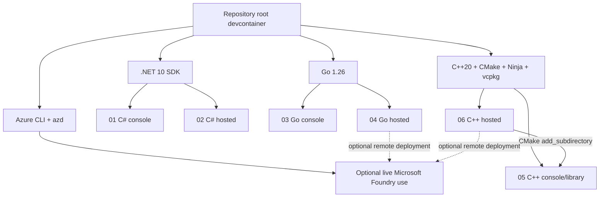
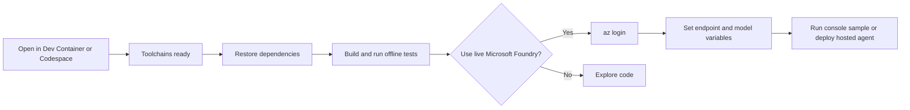

> **Implementation status:** Initial root devcontainer implementation added
> with the required toolchains, persistent dependency caches, and
> credential-free build/test tasks.

# Polyglot Devcontainer Feasibility Study

**Research date:** August 28, 2026  
**Repository baseline:** `Azure-Samples/microsoft-foundry-hosted-agents` at
`dd7739dc82bfd8104a3bcfcf86a6831b6c8a4e3a`  
**Query type:** Technical feasibility study

## Executive summary

Creating a single repository-level devcontainer for the .NET, Go, and C++
samples is technically feasible and would materially improve first-time
contributor onboarding. The repository already proves that all three
toolchains build on Ubuntu in CI, while its C++ deployment image independently
confirms Ubuntu 24.04 compatibility.[^1][^2] The recommended approach is one
root devcontainer based on the official C++ Ubuntu 24.04 image, with official
Dev Container Features adding .NET 10, Go 1.26, Azure CLI, Azure Developer CLI,
and GitHub CLI.[^3][^4]

The proposal should define "quickly test" as **open the repository, restore
dependencies, build all samples, and run credential-free tests**. Live
Microsoft Foundry calls remain an opt-in second step because they require a
contributor-owned project endpoint, model deployment, permissions, and an
interactive Azure sign-in.[^5][^6] Local OCI image builds should also be
optional: the hosted-agent manifests already request remote builds, so a Docker
daemon inside the devcontainer is not required for the primary path.[^7]

**Recommendation:** proceed with a prototype. Merge it only if a cold prebuilt
Codespace becomes usable within 2 minutes, a warm local rebuild within 3
minutes, and every credential-free CI-equivalent build/test passes. Without a
prebuild or durable vcpkg binary cache, the first C++ dependency build may take
roughly 8-30 minutes, which would undermine the stated quick-start goal; this
estimate must be measured in the prototype.[^8][^9]

## Scope and assumptions

This is a technical feasibility and architecture question. It requires
repository-specific build analysis, container architecture, security and
authentication considerations, and measurable acceptance criteria.

Assumptions:

- The devcontainer is intended to let visitors explore any of the six samples
  from one repository checkout.
- The default experience must not require Microsoft Foundry credentials.
- VS Code Dev Containers and GitHub Codespaces are both desirable targets.
- Linux is acceptable because the existing CI already validates all toolchains
  on Ubuntu.[^1]
- Deployment parity is useful but secondary to fast build/test onboarding.

## Repository constraints

The repository contains six small samples across C#, Go, and C++, split between
console and hosted-agent styles. The C# projects target `net10.0`; both Go
modules require Go 1.26; and the C++ projects require C++20, CMake 3.25 or
newer, Ninja, and vcpkg.[^10][^11][^12]

There is no existing devcontainer. The root solution covers only the two C#
projects, and there is no root Go workspace or root CMake super-build.[^13]
Consequently, a lifecycle script must invoke each ecosystem from the correct
location rather than assuming one repository-wide build command.

Sample 06 has the most important structural constraint: its CMake build imports
sample 05 through `add_subdirectory(../05-Foundry-Agent-CPP ...)`. The complete
repository must therefore be mounted as the workspace, preserving sibling
paths.[^14] Its deployment Dockerfile likewise copies both C++ sample
directories from a repository-root build context.[^15]



## Feasibility by toolchain

| Area | Feasibility | Key observations |
|---|---:|---|
| .NET 10 | High | Both projects use `net10.0`; the official .NET feature explicitly supports version `10.0`.[^10][^4] |
| Go 1.26 | High, prototype check required | The feature accepts a free-form version, but 1.26 was not listed among its metadata suggestions when researched. Confirm installation during the prototype.[^4] |
| C++20/CMake/Ninja | High | The official C++ image provides the heavy native toolchain; repository CI already builds both projects on Ubuntu.[^1][^3] |
| vcpkg | High, performance-sensitive | Both projects use manifests and the same registry baseline. There is no verified official vcpkg Feature, so bootstrap it in the image and persist its binary cache.[^16][^4] |
| Azure CLI authentication | High, opt-in | Install the CLI, but require `az login` at runtime. Never copy host token caches or credentials into the image.[^5][^6] |
| Azure Developer CLI | High | An official `azd` Feature is available and the hosted samples use `azure.yaml` manifests.[^4][^7] |
| Local Docker builds | Conditional | Docker-outside-of-Docker is practical locally but depends on a host socket; Docker-in-Docker adds size, privilege, and security cost. Neither is needed for the primary remote-build flow.[^4][^7] |
| amd64 | High | Matches CI and current hosted image assumptions.[^1] |
| arm64 | Medium | The C++ base supports arm64, but the Go hosted deployment Dockerfile hard-codes `GOARCH=amd64`; devcontainer support and deployment-image support are separate questions.[^3][^17] |

## Recommended architecture

### Use one root, all-in-one configuration

A single root configuration best matches the repository's visitor experience:
open once and choose any sample. Multiple language-specific configurations are
supported by Codespaces, but they add a selection decision and duplicate
configuration and prebuild maintenance.[^18] They are appropriate only if the
all-in-one image proves too slow or too large after measurement.

### Start from the official C++ Ubuntu 24.04 image

Use a semantically pinned official image such as:

```text
mcr.microsoft.com/devcontainers/cpp:3-noble
```

The C++ image is the most efficient base because it already includes compilers,
CMake, Ninja, debugger tooling, and a bootstrapped vcpkg installation, and it
supports both amd64 and arm64.[^3] Ubuntu 24.04 also aligns with the C++ hosted
agent Dockerfile.[^2]

The official Universal image is a workable fallback and may already contain
many required runtimes, but it includes numerous unrelated ecosystems and is
estimated to consume substantially more network and disk space. It is therefore
less suitable for a focused sample repository unless benchmarking proves its
pre-cached availability makes it faster in Codespaces.[^19]

### Add official Features

The prototype should validate these current feature identifiers and pin at
least their major versions:

```jsonc
{
  "image": "mcr.microsoft.com/devcontainers/cpp:3-noble",
  "features": {
    "ghcr.io/devcontainers/features/dotnet:2": {
      "version": "10.0"
    },
    "ghcr.io/devcontainers/features/go:1": {
      "version": "1.26"
    },
    "ghcr.io/devcontainers/features/azure-cli:1": {},
    "ghcr.io/azure/azure-dev/azd:latest": {
      "version": "stable"
    },
    "ghcr.io/devcontainers/features/github-cli:1": {}
  },
  "remoteEnv": {
    "VCPKG_ROOT": "/usr/local/vcpkg"
  }
}
```

The exact Go 1.26 resolution and the current vcpkg location in the selected C++
tag are prototype gates, not assumptions.[^3][^4]

### Separate image construction from dependency restoration

The image should contain stable tools. Repository dependencies should be
restored using lifecycle commands so they update when manifests change:

- Run `dotnet restore` at the repository root or against the solution.
- Run `go mod download` separately in samples 03 and 04.
- Configure CMake for samples 05 and 06 using `VCPKG_ROOT`.

Do not run a full C++ compile on every container start. Prefer an explicit
VS Code task such as "Build all samples" after lightweight restoration. For
Codespaces prebuilds, put expensive deterministic setup in `onCreateCommand` or
`updateContentCommand`; GitHub prebuilds do not snapshot `postCreateCommand`
work.[^20]

### Persist ecosystem caches

Use named volumes or equivalent durable caches outside the workspace for:

- NuGet: `~/.nuget/packages`
- Go modules and build cache: `~/go/pkg/mod` and `~/.cache/go-build`
- vcpkg binary archives: `~/.cache/vcpkg/archives`

The vcpkg archive location should match CI, which already caches it based on
both C++ manifests and configuration files.[^21] Build products should remain
in their existing per-sample directories to preserve current CMake preset
behavior.[^12]

### Make Docker support optional

Do not make Docker-in-Docker part of the first version. Both container-hosted
samples specify remote builds in their deployment manifests, allowing
deployment without a local daemon.[^7] If contributors need local image builds:

1. Prefer Docker-outside-of-Docker on trusted local machines.
2. Document that it exposes significant host control through the Docker socket.
3. Do not assume that host socket forwarding is portable to every Codespaces
   environment.
4. Offer Docker-in-Docker only as a separate devcontainer configuration if
   demand justifies its privileged, storage, and startup costs.

## Intended user journey



The default path ends after credential-free builds and tests. A contributor who
wants live behavior then:

1. Runs `az login` inside the container.
2. Supplies `FOUNDRY_PROJECT_ENDPOINT`.
3. Optionally supplies `AZURE_AI_MODEL_DEPLOYMENT_NAME`; samples otherwise
   default to `gpt-5-mini`.
4. Runs the selected console sample or uses `azd` for a hosted sample.[^5][^6]

No project endpoint, token, client secret, or Azure CLI cache should be embedded
in the image, committed to configuration, or passed as a Docker build argument.
The repository already ignores local `.env` files while retaining
examples.[^22]

## Performance and cost

The C++ dependency graph dominates cold setup because vcpkg may compile Azure
SDK libraries, curl, OpenSSL-related dependencies, Catch2, and cpp-httplib from
source.[^16] Research estimates ranged from 8-18 minutes to 15-30 minutes on a
four-core machine without a binary cache; these are planning ranges, not
measured repository benchmarks.[^8][^9]

| Scenario | Planning estimate | Required response |
|---|---:|---|
| Cold local image build, no vcpkg cache | 15-30 minutes | Acceptable only for maintainers, not the advertised visitor path |
| Warm local rebuild with persistent caches | 2-4 minutes | Target <=3 minutes |
| Codespace from prebuild | Under 2 minutes to usable terminal | Required for "quickly test" claim |
| NuGet restore, warm | 10-30 seconds | Accept |
| Go module download, warm | 5-15 seconds | Accept |
| vcpkg restore, warm binary cache | 20-60 seconds | Accept |

An all-in-one focused image is expected to be large, likely around 1.5-2.5 GB
compressed after adding language and cloud tools; this is an estimate that must
be measured.[^23] The Universal image alternative was estimated at 4.5-5 GB
compressed and 10-12 GB expanded, but those figures were not available from a
directly authenticated registry manifest and should not be treated as
decision-grade until benchmarked.[^19]

For Codespaces, configure a prebuild for the default branch after the prototype
is stable. Prebuilds consume storage and multiply across branch, region, and
devcontainer configuration, another reason to begin with one
configuration.[^20]

## Security and operational risks

| Risk | Likelihood | Impact | Mitigation |
|---|---:|---:|---|
| Credentials accidentally baked into image | Low | Critical | Runtime `az login`; no secrets in Dockerfile, Features, or build arguments |
| Project endpoint exposed in public config | Medium | Medium | Use local `.env` or Codespaces secret; retain placeholder examples |
| Host compromise through Docker socket | Medium if enabled | Critical | Exclude from default; document trust boundary; prefer remote builds |
| Privileged Docker-in-Docker container | Medium if enabled | High | Separate optional configuration; avoid for default |
| Toolchain version drift | Medium | High | Pin image/Feature majors and language versions; add a devcontainer smoke workflow |
| Go 1.26 Feature resolution failure | Medium until tested | Medium | Prototype check; fall back to verified manual installation |
| vcpkg cold restore makes onboarding slow | High without prebuild/cache | High | Durable binary cache and Codespaces prebuild |
| arm64 contributor mismatch | Medium | Medium | Test devcontainer on arm64; document amd64-only hosted Go image behavior |
| Preview SDK packages change rapidly | Medium | Medium | Keep dependency manifests authoritative; never bake package restores permanently into a stale image |

## Alternatives considered

### One focused all-in-one devcontainer - recommended

Advantages:

- One-click entry point for all six samples.
- Closest match to the repository's educational purpose.
- One configuration and prebuild to maintain.
- Preserves the sample folders and deployed identifiers unchanged.

Disadvantages:

- Larger image than a language-specific container.
- Any toolchain version update can invalidate the shared image cache.
- C++ restoration remains expensive without prebuilds.

### Three language-specific devcontainers

Advantages:

- Smaller images and less irrelevant tooling per contributor.
- Failures are isolated by ecosystem.

Disadvantages:

- Users must choose correctly before opening.
- Three configurations, documentation paths, and prebuilds.
- Makes cross-language comparison less convenient.
- More opportunities for cloud tooling and authentication guidance to drift.

This is the fallback if the focused all-in-one image cannot meet the performance
thresholds.

### Universal image

Advantages:

- Broad tool coverage with minimal configuration.
- Potentially familiar and pre-cached in Codespaces.

Disadvantages:

- Substantially larger and includes unrelated runtimes.
- Moving `latest` tags can reduce reproducibility.

Use only if measured Codespaces start time is better than the focused image and
local disk cost is acceptable.

### No devcontainer; improve setup documentation only

This avoids image maintenance but does not solve the core onboarding problem:
visitors still install seven or more tools and reconcile versions
themselves.[^24] It is lower effort but lower value.

## Prototype and acceptance plan

### Toolchain smoke test

Inside fresh amd64 and, where available, arm64 containers, verify:

```text
dotnet --version        -> 10.0.x
go version              -> 1.26.x
cmake --version         -> >= 3.25
ninja --version         -> succeeds
vcpkg version           -> succeeds
az version              -> succeeds
azd version             -> succeeds
gh --version            -> succeeds
```

Also verify that `VCPKG_ROOT/scripts/buildsystems/vcpkg.cmake` exists.

### Credential-free repository validation

Run the same logical coverage as CI:

1. Build the root .NET solution.
2. Build and test sample 03 from its module directory.
3. Build and test sample 04 from its module directory.
4. Configure, build, and test sample 05 with its debug CMake preset.
5. Configure, build, and test sample 06 with its debug CMake preset.

The Go commands must not run from the repository root because there is no root
`go.work` file.[^25] Sample 06 must preserve its sibling path to sample 05.[^14]

### Optional deployment-image validation

- Build the Go hosted image from its sample directory.
- Build the C++ hosted image using the repository root as context and its
  nested Dockerfile.
- Confirm both expose their existing port and readiness behavior.
- Test this phase only when Docker access has explicitly been enabled.

### Optional live Microsoft Foundry validation

Use a disposable or approved development project:

- Complete interactive Azure sign-in inside the container.
- Set the two documented environment variables.
- Run the three console samples.
- Start the hosted samples and verify their local readiness endpoints.
- Run `azd` validation/deployment only with explicit authorization.

Live validation is not suitable as a required public-repository CI gate because
it consumes cloud resources and requires credentials; the current CI
intentionally compiles and tests without Microsoft Foundry credentials.[^1]

### Performance measurement

Record:

- Base image pull bytes and duration.
- Feature installation duration.
- First dependency restore duration by ecosystem.
- First complete build duration.
- Rebuild after no changes.
- Rebuild after editing one source file per ecosystem.
- Rebuild after recreating the container with named cache volumes.
- Codespace startup from a prebuild.
- Expanded image and cache disk usage.

### Merge gates

| Gate | Threshold |
|---|---:|
| CI-equivalent credential-free validation | 100% pass |
| Codespace prebuild to usable shell | <=2 minutes |
| Warm local rebuild/recreate | <=3 minutes |
| Warm vcpkg dependency restoration | <=90 seconds |
| Required secrets in image history/config | 0 |
| Default privileged mode | Disabled |
| Default Docker socket mount | Disabled |
| amd64 toolchain checks | 100% pass |
| arm64 devcontainer toolchain checks | Pass or documented limitation |
| Documentation | Clear offline-first and optional live steps |

If the all-in-one image misses the startup target by more than 50%, test the
three-language split before abandoning the proposal. If Go 1.26 cannot be
installed reproducibly with the official Feature, pin a checksum-verified
installation in the devcontainer Dockerfile rather than silently using another
Go version.

## Maintenance plan

- Keep repository manifests and CI as the source of truth for supported
  versions.
- Pin the base image to a major Ubuntu 24.04 tag, not an unbounded `latest`.
- Pin Feature major versions and explicitly specify .NET and Go versions.
- Rebuild the devcontainer in CI when `.devcontainer/**`, language manifests,
  CMake presets, vcpkg configuration, or the root build workflow changes.
- Dependabot can monitor devcontainer Features if configured, but version
  updates still require all six smoke checks.
- Review the container quarterly and when .NET, Go, vcpkg, or Microsoft Foundry
  SDK versions change.
- Keep live credentials and project-specific identifiers outside image layers
  and source control.

## Decision

**Feasibility rating: 8/10.**

The implementation is straightforward and aligns with the existing Linux CI.
The two material uncertainties are operational rather than architectural:

1. Whether Go 1.26 installs reproducibly through the current official Feature.
2. Whether vcpkg restoration can meet the quick-start promise with a prebuild
   and persistent binary cache.

Neither is a blocker to prototyping. The recommended minimum viable change is:

1. One root devcontainer based on the official C++ Ubuntu 24.04 image.
2. Official Features for .NET 10, Go 1.26, Azure CLI, Azure Developer CLI, and
   GitHub CLI.
3. Persistent NuGet, Go, and vcpkg caches.
4. Lightweight dependency restoration plus explicit build tasks.
5. No Docker daemon or socket in the default configuration.
6. Offline build/test as the guaranteed experience.
7. Optional documented sign-in and live Microsoft Foundry workflow.
8. A default-branch Codespaces prebuild if the repository intends to advertise
   one-click testing.

This design delivers the visitor benefit without conflating a development
environment with the hosted agents' production images or weakening credential
boundaries.

## Confidence assessment

**High confidence**

- The required toolchain versions and repository build topology.
- Linux feasibility for all three ecosystems.
- The cross-folder C++ dependency and repository-root workspace requirement.
- The availability of official base images and Features for the principal
  tools.
- The separation between credential-free builds and live Microsoft Foundry
  use.
- Remote builds remove the need for Docker in the default deployment path.

**Medium confidence**

- Go 1.26 installation through the current Go Feature; its version field is
  flexible, but 1.26 was not in the feature metadata suggestions at research
  time.
- arm64 parity for every workflow; the devcontainer base supports it, while one
  deployment Dockerfile explicitly targets amd64.
- Exact image size and setup duration.

**Low confidence until measured**

- Cold and warm timing estimates, especially vcpkg compilation.
- Codespaces layer-cache behavior for the chosen exact image.
- Whether prebuild storage cost is acceptable for the repository owners.

The research used the repository's `main` commit
`dd7739dc82bfd8104a3bcfcf86a6831b6c8a4e3a`. Any branch-only changes should be
rechecked before implementation.

## Footnotes

[^1]: [`.github/workflows/build.yml`](https://github.com/Azure-Samples/microsoft-foundry-hosted-agents/blob/dd7739dc82bfd8104a3bcfcf86a6831b6c8a4e3a/.github/workflows/build.yml#L1-L81)
[^2]: [`06-Foundry-Agent-CPP-Hosted/Dockerfile:3-35`](https://github.com/Azure-Samples/microsoft-foundry-hosted-agents/blob/dd7739dc82bfd8104a3bcfcf86a6831b6c8a4e3a/06-Foundry-Agent-CPP-Hosted/Dockerfile#L3-L35)
[^3]: [Dev Containers C++ image manifest](https://github.com/devcontainers/images/blob/main/src/cpp/manifest.json)
[^4]: [Dev Container Features collection](https://github.com/devcontainers/features/tree/main/src)
[^5]: [`README.md:27-51`](https://github.com/Azure-Samples/microsoft-foundry-hosted-agents/blob/dd7739dc82bfd8104a3bcfcf86a6831b6c8a4e3a/README.md#L27-L51)
[^6]: [`01-MAF-Agent-CS/Program.cs:5-9`](https://github.com/Azure-Samples/microsoft-foundry-hosted-agents/blob/dd7739dc82bfd8104a3bcfcf86a6831b6c8a4e3a/01-MAF-Agent-CS/Program.cs#L5-L9)
[^7]: [`04-MAF-Agent-GO-Hosted/azure.yaml:10-14`](https://github.com/Azure-Samples/microsoft-foundry-hosted-agents/blob/dd7739dc82bfd8104a3bcfcf86a6831b6c8a4e3a/04-MAF-Agent-GO-Hosted/azure.yaml#L10-L14); [`06-Foundry-Agent-CPP-Hosted/azure.yaml:10-15`](https://github.com/Azure-Samples/microsoft-foundry-hosted-agents/blob/dd7739dc82bfd8104a3bcfcf86a6831b6c8a4e3a/06-Foundry-Agent-CPP-Hosted/azure.yaml#L10-L15)
[^8]: Planning estimate synthesized from repository dependency scope in [`05-Foundry-Agent-CPP/vcpkg.json`](https://github.com/Azure-Samples/microsoft-foundry-hosted-agents/blob/dd7739dc82bfd8104a3bcfcf86a6831b6c8a4e3a/05-Foundry-Agent-CPP/vcpkg.json#L5-L11) and [`06-Foundry-Agent-CPP-Hosted/vcpkg.json`](https://github.com/Azure-Samples/microsoft-foundry-hosted-agents/blob/dd7739dc82bfd8104a3bcfcf86a6831b6c8a4e3a/06-Foundry-Agent-CPP-Hosted/vcpkg.json#L5-L12); must be benchmarked.
[^9]: [vcpkg binary caching documentation](https://learn.microsoft.com/vcpkg/users/binarycaching)
[^10]: [`01-MAF-Agent-CS/01-MAF-Agent-CS.csproj:1-10`](https://github.com/Azure-Samples/microsoft-foundry-hosted-agents/blob/dd7739dc82bfd8104a3bcfcf86a6831b6c8a4e3a/01-MAF-Agent-CS/01-MAF-Agent-CS.csproj#L1-L10); [`02-MAF-Agent-CS-Hosted/02-MAF-Agent-CS-Hosted.csproj:1-10`](https://github.com/Azure-Samples/microsoft-foundry-hosted-agents/blob/dd7739dc82bfd8104a3bcfcf86a6831b6c8a4e3a/02-MAF-Agent-CS-Hosted/02-MAF-Agent-CS-Hosted.csproj#L1-L10)
[^11]: [`03-MAF-Agent-GO/go.mod:1-8`](https://github.com/Azure-Samples/microsoft-foundry-hosted-agents/blob/dd7739dc82bfd8104a3bcfcf86a6831b6c8a4e3a/03-MAF-Agent-GO/go.mod#L1-L8); [`04-MAF-Agent-GO-Hosted/go.mod:1-9`](https://github.com/Azure-Samples/microsoft-foundry-hosted-agents/blob/dd7739dc82bfd8104a3bcfcf86a6831b6c8a4e3a/04-MAF-Agent-GO-Hosted/go.mod#L1-L9)
[^12]: [`05-Foundry-Agent-CPP/CMakePresets.json:4-18`](https://github.com/Azure-Samples/microsoft-foundry-hosted-agents/blob/dd7739dc82bfd8104a3bcfcf86a6831b6c8a4e3a/05-Foundry-Agent-CPP/CMakePresets.json#L4-L18)
[^13]: [`MAF-Agents-Samples.slnx`](https://github.com/Azure-Samples/microsoft-foundry-hosted-agents/blob/dd7739dc82bfd8104a3bcfcf86a6831b6c8a4e3a/MAF-Agents-Samples.slnx); [`.vscode/settings.json`](https://github.com/Azure-Samples/microsoft-foundry-hosted-agents/blob/dd7739dc82bfd8104a3bcfcf86a6831b6c8a4e3a/.vscode/settings.json)
[^14]: [`06-Foundry-Agent-CPP-Hosted/CMakeLists.txt:7-10`](https://github.com/Azure-Samples/microsoft-foundry-hosted-agents/blob/dd7739dc82bfd8104a3bcfcf86a6831b6c8a4e3a/06-Foundry-Agent-CPP-Hosted/CMakeLists.txt#L7-L10)
[^15]: [`06-Foundry-Agent-CPP-Hosted/Dockerfile:23-29`](https://github.com/Azure-Samples/microsoft-foundry-hosted-agents/blob/dd7739dc82bfd8104a3bcfcf86a6831b6c8a4e3a/06-Foundry-Agent-CPP-Hosted/Dockerfile#L23-L29)
[^16]: [`05-Foundry-Agent-CPP/vcpkg-configuration.json`](https://github.com/Azure-Samples/microsoft-foundry-hosted-agents/blob/dd7739dc82bfd8104a3bcfcf86a6831b6c8a4e3a/05-Foundry-Agent-CPP/vcpkg-configuration.json); [`06-Foundry-Agent-CPP-Hosted/vcpkg-configuration.json`](https://github.com/Azure-Samples/microsoft-foundry-hosted-agents/blob/dd7739dc82bfd8104a3bcfcf86a6831b6c8a4e3a/06-Foundry-Agent-CPP-Hosted/vcpkg-configuration.json)
[^17]: [`04-MAF-Agent-GO-Hosted/Dockerfile:1-12`](https://github.com/Azure-Samples/microsoft-foundry-hosted-agents/blob/dd7739dc82bfd8104a3bcfcf86a6831b6c8a4e3a/04-MAF-Agent-GO-Hosted/Dockerfile#L1-L12)
[^18]: [GitHub Docs: Introduction to dev containers](https://docs.github.com/codespaces/setting-up-your-project-for-codespaces/introduction-to-dev-containers)
[^19]: Size figures are unverified planning estimates from the research comparison; see the official [Universal image definition](https://github.com/devcontainers/images/tree/main/src/universal) for its broad tool inventory.
[^20]: [GitHub Docs: About GitHub Codespaces prebuilds](https://docs.github.com/codespaces/prebuilding-your-codespaces/about-github-codespaces-prebuilds)
[^21]: [`.github/workflows/build.yml:55-68`](https://github.com/Azure-Samples/microsoft-foundry-hosted-agents/blob/dd7739dc82bfd8104a3bcfcf86a6831b6c8a4e3a/.github/workflows/build.yml#L55-L68)
[^22]: [`.gitignore:438-440`](https://github.com/Azure-Samples/microsoft-foundry-hosted-agents/blob/dd7739dc82bfd8104a3bcfcf86a6831b6c8a4e3a/.gitignore#L438-L440)
[^23]: Planning estimate based on the combined official C++ image, .NET, Go, Azure CLI, Azure Developer CLI, and GitHub CLI layers; exact registry and expanded sizes must be recorded during the prototype.
[^24]: [`README.md:33-38`](https://github.com/Azure-Samples/microsoft-foundry-hosted-agents/blob/dd7739dc82bfd8104a3bcfcf86a6831b6c8a4e3a/README.md#L33-L38)
[^25]: [`.github/workflows/build.yml:27-44`](https://github.com/Azure-Samples/microsoft-foundry-hosted-agents/blob/dd7739dc82bfd8104a3bcfcf86a6831b6c8a4e3a/.github/workflows/build.yml#L27-L44)
